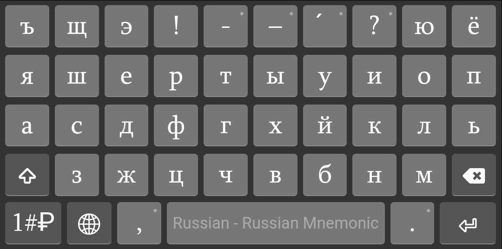
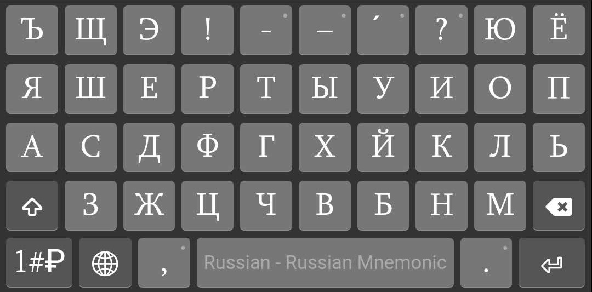
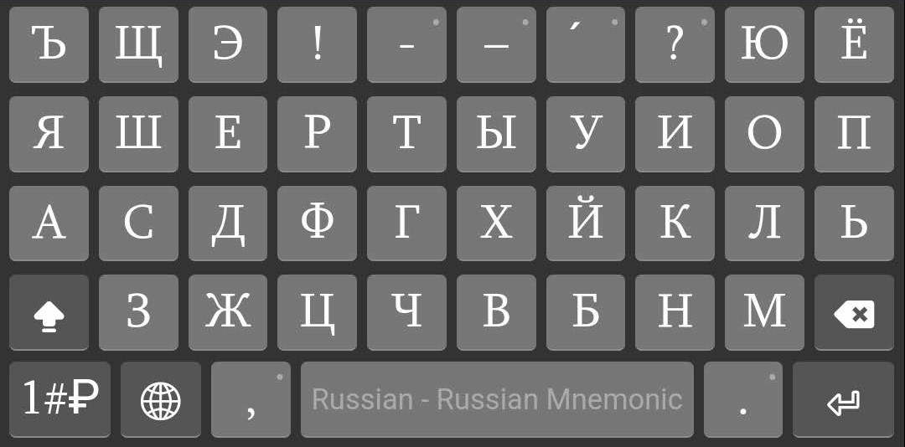
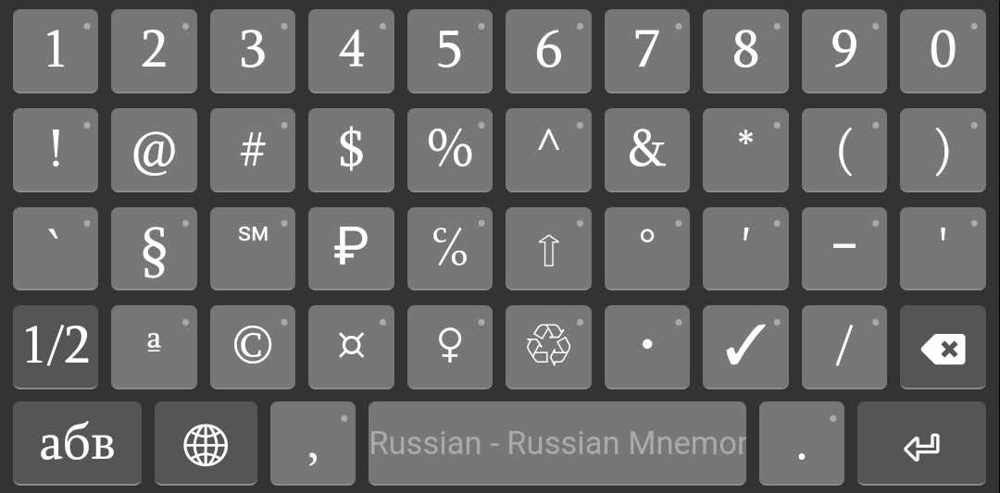
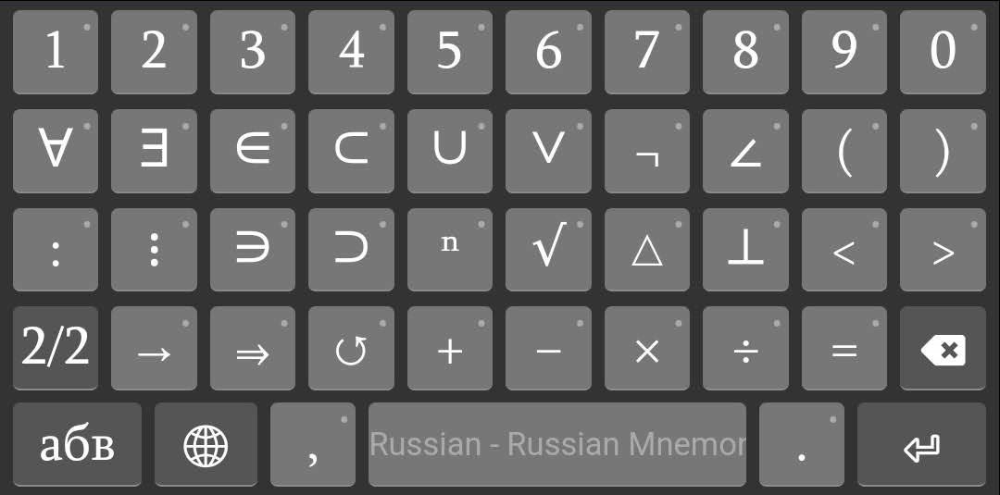

## Русская мнемоническая раскладка клавиатуры

&nbsp;&nbsp;&nbsp;&nbsp;В эта раскладка клавиатуры включает в себя буквы русского алфавита, цифры, знаки препинания, математические знаки, а также специальные символы, которые часто используются при наборе текста на русском языке, а также те, которые размещаются на латинской раскладке клавиатуры, особенно наиболее распространенной в настоящее время — «US». Раскладка клавиатуры является мнемонической, поскольку каждая буква и символ связаны с латинскими буквами, звуками, идеями и формами, и, следовательно, это помогает запомнить их места на латинской клавиатуре. [Установка](#установка) возможна на известные операционные системы, но перед установкой можно попробовать на <a href="https://dotland.github.io/keymanweb-demo-ru" target="_blank">веб-странице</a>.

&nbsp;&nbsp;&nbsp;&nbsp;В этой раскладке клавиатуры есть составные (также немые) клавиши. Когда составная клавиша предшествует другому клавишу, вводится русская буква или знак. Например, чтобы ввести русскую букву **Ч**, нужно нажать на клавише `C`, затем на `H`. Раскладка клавиатуры «US International» — подобная раскладка клавиатуры, которая позволяет вводить буквы западно‐европейских языков (например, чтобы ввести букву **à**, нужно нажать на клавише `՝` затем на `a`). На следующих рисунках представлена русская мнемоническая раскладка клавиатуры в разных состояниях клавиш-модификаторов, где светло-серые клавиши представляют собой составные (немые) клавиши.

##### Рис. 1. Русская мнемоническая клавиатура

##### Рис. 2. Русская мнемоническая клавиатура с включенной клавишей `Caps Lock`

##### Рис. 3. Русская мнемоническая клавиатура с нажатой клавишей `Shift`

##### Рис. 4. Русская мнемоническая клавиатура с нажатой клавишей `AltGr`

##### Рис. 5. Русская мнемоническая клавиатура с сочетанием клавиш `AltGr`+`Shift`

Клавиша `AltGr` — [Alt Graph](https://en.wikipedia.org/wiki/AltGr_key), правая клавиша `Alt` в ОС-ах Windows и Linux, а в ОС-е macOS этой клавише соответствует клавиша `⌥` ([Option](https://en.wikipedia.org/wiki/Option_key)).

### Русский алфавит

&nbsp;&nbsp;&nbsp;&nbsp;В русском алфавите 33 буквы. Из них — 21 согласная Б В Г Д Ж З Й К Л М Н П Р С Т Ф Х Ц Ч Ш Щ, 10 гласных А Е Ё И О У Ы Э Ю Я и две буквы, которые не обозначают никаких звуков, это Ъ (твёрдый знак) и Ь (мягкий знак). В следующей таблице представлен русский алфавит и латинская транслитерация:  
1-й столбец — номер буквы,  
2-й столбец — буква (заглавная и строчная),  
3‐й столбец — название буквы,  
4‐й столбец — произношение на языке латинского происхождения,  
5‐й столбец — последовательное нажатие клавиш,  
6-й столбец — пальцы, которыми можно быстро нажимать на клавиши.  

| №     | буква         | название        | клавиши            | пальцы                         |
| ---:  |  :---         | :---            | :---:              | :---                           |
| 1     | А &nbsp; а    | а               | `A`                | л. мизинец                     |
| 2     | Б &nbsp; б    | бэ              | `B`                | л. указательный                |
| 3     | В &nbsp; в    | вэ              | `V`                | л. указательный                |
| 4     | Г &nbsp; г    | гэ              | `G`                | л. указательный                |
| 5     | Д &nbsp; д    | дэ              | `D`                | л. средний                     |
| 6     | Е &nbsp; е    | е               | `E`                | л. средний                     |
| 7     | Ё &nbsp; ё    | ё               | `J` `O`            | п. указательный, п. безымянный |
| 8     | Ж &nbsp; ж    | жэ              | `X`                | л. безымянный                  |
| 9     | З &nbsp; з    | зэ              | `Z`                | л. мизинец                     |
| 10    | И &nbsp; и    | и               | `I`                | п. средний                     |
| 11    | Й &nbsp; й    | и краткое       | `J`                | п. указательный                |
| 12    | К &nbsp; к    | ка              | `K`                | п. средний                     |
| 13    | Л &nbsp; л    | эль             | `L`                | п. безымянный                  |
| 14    | М &nbsp; м    | эм              | `M`                | п. указательный                |
| 15    | Н &nbsp; н    | эн              | `N`                | п. указательный                |
| 16    | О &nbsp; о    | о               | `O`                | п. безымянный                  |
| 17    | П &nbsp; п    | пэ              | `P`                | п. мизинец                     |
| 18    | Р &nbsp; р    | эр              | `R`                | л. указательный                |
| 19    | С &nbsp; с    | эс              | `S`                | л. безымянный                  |
| 20    | Т &nbsp; т    | тэ              | `T`                | л. указательный                |
| 21    | У &nbsp; у    | у               | `U`                | п. указательный                |
| 22    | Ф &nbsp; ф    | эф              | `F`                | л. указательный                |
| 23    | Х &nbsp; х    | ха              | `H`                | п. указательный                |
| 24    | Ц &nbsp; ц    | цэ              | `C`                | л. средний                     |
| 25    | Ч &nbsp; ч    | че              | `C` `H`            | л. средний, п. указательный    |
| 26    | Ш &nbsp; ш    | ша              | `W`   `S` `H` | л. безымянный   л. безымянный, п. указательный |
| 27    | Щ &nbsp; щ    | ща              | `S` `C`            | л. безымянный, л. средний      |
| 28    | Ъ &nbsp; ъ    | твёрдый знак    | `՝`                | л. мизинец                     |
| 29    | Ы &nbsp; ы    | ы               | `Y`                | п. указательный                |
| 30    | Ь &nbsp; ь    | мягкий знак     | `'`                | п. мизинец                     |
| 31    | Э &nbsp; э    | э               | `J` `E`            | п. указательный, л. средний    |
| 32    | Ю &nbsp; ю    | ю               | `J` `U`            | п. указательный, п. указательный |
| 33    | Я &nbsp; я    | я               | `Q`   `J` `A` | л. мизинец   п. указательный, л. мизинец |

&nbsp;&nbsp;&nbsp;&nbsp;Для ввода заглавной буквы, удерживая клавишу `Shift`, нужно нажать на соответствующую клавишу или достаточно первой клавиши, если их две. На клавиатуре есть две клавиши `Shift`. Чтобы печатать быстро, левую клавишу `Shift` следует нажимать мизинцем левой руки, а правую клавишу `Shift` — правым мизинцем. Если все буквы слова заглавные, это слово можно быстро напечатать следующим образом: сперва включите клавишу `Caps Lock`, введите слово, затем выключите клавишу `Caps Lock`. Для быстрого набора текста, важно правильное постановка пальцев на клавиатуре. Клавиши `F` и `J` имеют выпуклости, что можно почувствовать указательными пальцами не смотря на клавиатуру. Таким образом, находите клавиши `F` и `J` указательными пальцами. Теперь согните пальцы и опустите остальные пальцы на следующие три клавиши с обеих сторон (с левой стороны `A`–`F`, с правой стороны `J`–`;`). Это позиция называется исходной позицией. Указательные пальцы должны всегда возвращаться на исходную позицию находя выпуклости на клавишах `F` и `J`. А на клавише пробела можно быстро нажать большим пальцем. На следующем рисунке представлена таблица набора текста, которая представляет собой метод для быстрого набора текста и предотвращения возможных ошибок.  

##### Рис. 6. Таблица набора текста

#### Примеры выражений

&nbsp;&nbsp;&nbsp;&nbsp;Для простоты примеров, примем следующие обозначения: клавиша `q` соответствует букве **я**, а клавиша `Q`, то же что и `Shift`+`q`, букве **Я**. В следующей таблице представлены выражения с соответствующими нажатиями клавиш:

| выражение                 | последовательность клавиш                   |
| :---                      | :----                                       |
| Сюжетная линия            | `S` `j` `u` `x` `e` `t` `n` `a` `q`&nbsp;` `&nbsp;`l` `i` `n` `i` `q` |
| Сила настоящего           | `S` `i` `l` `a`&nbsp;` `&nbsp;`n` `a` `s` `t` `o` `j` `a` `s` `c` `e` `g` `o` |
| Счастливого пути          | `S`&nbsp;` `&nbsp;`c` `h` `a` `s` `t` `l` `i` `v` `o` `g` `o`&nbsp;` `&nbsp;`p` `u` `t` `i` |
| Дождь должен идти         | `D` `o` `x` `d` `'`&nbsp;` `&nbsp;`d` `o` `l` `x` `e` `n`&nbsp;` `&nbsp;`i` `d` `t` `i` |
| Волшебство рассвета       | `V` `o` `l` `w` `e` `b` `s` `t` `v` `o`&nbsp;` `&nbsp;`r` `a` `s` `s` `v` `e` `t` `a` |
| Живописный японский клён  | `X` `i` `v` `o` `p` `i` `s` `n` `y` `j`&nbsp;` `&nbsp;` `&nbsp;`q` `p` `o` `n` `s` `k` `i` `j`&nbsp;` `&nbsp;` `&nbsp;`k` `l` `j` `o` `n` |

&nbsp;&nbsp;&nbsp;&nbsp;Обратите внимание, что после слов *Живописный* и *японский* есть дополнительный пробел. Это связано с тем, что `J` является составной клавишей. После нажатия составной клавиши, редактор ввода находится в ожидании нажатия другой клавиши. Дополнительный пробел есть и в слове *Счастливого* после буквы *С*. Этот пробел необходим, потому что в противном случае был бы введен буква *Щ*. При нажатии на составной клавише в ОС-е macOS сразу вводится и выделяется соответствующая первая буква.

### Русская пунктуация

&nbsp;&nbsp;&nbsp;&nbsp;В русской пунктуации употребляются десять знаков: точка, запятая, двоеточие, тире, точка с запятой, вопросительный знак, восклицательный знак, многоточие, кавычки, скобки:

| Юникод №  | знак    | название                  | клавиши             | описание                            |
| :---      |  :---:  | :---                      |    :---:            | :---                                |
| [002e](https://unicode-table.com/ru/002e)      | .       | точка                     | `.`                 | 

Ставится…
 • в конце повествовательного предложения;   • в конце побудительного предложения при спокойном тоне речи;   • в конце рубрик перечисления, если они представляют собой самостоятельные предложения, имеющие внутренние знаки препинания. 
 |
| [002c](https://unicode-table.com/ru/002c)      | ,       | запятая                   | `,`                 | 

Ставится…
 • между однородными членами предложения;   • при обособлении второстепенных членов предложения;   • в предложениях с уточняющими, пояснительными и присоединительными членами предложения;   • при обращении;   • при вводных словах;   • при вводных и вставных предложениях;   • в сложносочинённых предложениях;   • в сложноподчинённых предложениях;   • при сравнительных оборотах;   • в бессоюзных предложениях. 
 |
| [003а](https://unicode-table.com/ru/003a)      | :       | двоеточие                 | `Shift`+`;`         | 

Ставится…
 • перед однородными членами предложения после обобщающего слова;   • в бессоюзных сложных предложениях;   • при прямой речи;   • при цитатах. 
 |
| [2013](https://unicode-table.com/ru/2013)    [2014](https://unicode-table.com/ru/2014) | –    — | среднее тире    длинное тире | `AltGr`+`-`    `AltGr`+`Shift`+`-` | 

Ставится…
 • между подлежащим и сказуемым;   • в неполном предложении;   • в качестве интонационного тире;   • после однородных членов предложения перед обобщающим словом;   • в качестве соединительного тире;   • при обособленных приложениях;   • при вводных и вставных предложениях;   • в бессоюзных сложных предложениях;   • при прямой речи;   • при диалоге. 
   Длинное тире употребляется в большинстве случаев, а среднее тире — при обозначении диапазонов (например, 1478–1519 гг.), и т.п. |
| [003b](https://unicode-table.com/ru/003b)      | ;       | точка с запятой           | `;`                 | 

Ставится…
 • в конце рубрик перечисления;   • при распространённых однородных членах предложения;   • в сложносочинённых предложениях;   • в сложноподчинённых предложениях;   • в бессоюзных сложных предложениях. 
 |
| [003f](https://unicode-table.com/ru/003f)      | ?       | вопросительный знак       | `Shift`+`/`         | 

Ставится…
 • в конце вопросительного предложения. 
 |
| [0021](https://unicode-table.com/ru/0021)      | !       | восклицательный знак      | `Shift`+`1`         | 

Ставится…
 • в конце восклицательного предложения;   • после обращения. 
 |
| [2026](https://unicode-table.com/ru/2026)      | …       | многоточие                | `AltGr`+`;`         | 

Ставится…
 • при незаконченных высказываниях, при перерывах в речи;   • в цитатах для указания на то, что цитата приводится не полностью. 
 |
| [00ab](https://unicode-table.com/ru/00ab)     [00bb](https://unicode-table.com/ru/00bb)     [201c](https://unicode-table.com/ru/201c)     [201d](https://unicode-table.com/ru/201d) | «     »     “     ” | открывающая (левая) кавычка «ёлочка»    закрывающая (правая) кавычка «ёлочка»    левая кавычка «лапки»    правая кавычка «лапки» | `AltGr`+`Shift`+`,`     `AltGr`+`Shift`+`.`     `AltGr`+`[`     `AltGr`+`]` | 

Ставится…
 • при прямой речи;   • при цитатах;   • при словах, употребляемых не в своём обычном значении;   • при названиях литературных произведений, газет и т. д.;   • при названиях предприятий, организаций, фирм и т. д.;   • при названиях орденов и медалей;   • при названиях марок изделий. 
   Для кавычек внутри кавычек и при письме от руки используются “лапки”, например: *Литературная газета сообщает: «“Гарри Поттер” сейчас одна из самых популярных книг среди подростков»*. |
| [0028](https://unicode-table.com/ru/0028)    [0029](https://unicode-table.com/ru/0029)  | (    )  | левая круглая скобка    правая круглая скобка | `Shift`+`9`    `Shift`+`0` | 

Ставится…
 • при вводных и вставных предложениях;   • при пояснительных словах. 
 |

&nbsp;&nbsp;&nbsp;&nbsp;Знаки препинания либо отделяют части текста друг от друга, либо выделяют какие‐либо отрезки внутри частей:  
‣ Отделяющими знаками являются точка, восклицательный и вопросительный знаки, точка с запятой, двоеточие, многоточие, абзац. Абзац усиливает значение предшествующей точки и открывает совершенно иной ход повествования.  
‣ К выделяющим знакам относятся скобки и кавычки.  
Запятая и тире выступают в роли отделяющих (при единичности употребления) и в роли выделяющих (при парном употреблении, например при обособлении, при выделении вводных и вставных конструкций). При встрече внутри предложения запятой и тире сначала ставится запятая, а затем тире:  
&nbsp;&nbsp;&nbsp;&nbsp;*Единственное, что изменилось в вестибюле пароходства, — это стены.*  
&nbsp;&nbsp;&nbsp;&nbsp;При встрече вопросительного и восклицательного знаков сначала ставится вопросительный, как основной, характеризующий предложение по цели высказывания, а затем восклицательный, как знак интонационный:   
&nbsp;&nbsp;&nbsp;&nbsp;*«За что?!» — говорили ее глаза.*  
&nbsp;&nbsp;&nbsp;&nbsp;Если необходимо одновременно поставить многоточие и вопросительный или восклицательный знак, то после них ставится две точки:   
&nbsp;&nbsp;&nbsp;&nbsp;*— Но как же это по-русски сказать?..*   
&nbsp;&nbsp;&nbsp;&nbsp;*— Вот как!..*

#### Орфографические знаки

&nbsp;&nbsp;&nbsp;&nbsp;В русской письменности есть ещё знаки, которые являются частью слова. К таким небуквенным орфографическим знакам относятся апостроф, дефис, точка (в сокращениях), косая черта и знак ударения:

| Юникод №  | знак        | название                  | клавиши             | описание                            |
| :---      |  :---:      | :---                      |    :---:            | :---                                |
| [2019](https://unicode-table.com/ru/2019)      | ’           | апостроф                  | `AltGr`+`,`         | 

Ставится…
 • на месте иноязычного апострофа в иностранных именах собственных, чаще всего после начальных элементов д’, О’ и л’ (Жанна д’Арк, О’Коннор, д’Артаньян, Брен-л’Аллё);   • для отделения русских окончаний и суффиксов от начальной части слова, записанной латиницей (c-moll’ная увертюра, пользоваться E-mail’ом, перевод A. Préchac’а). 
 |
| [002d](https://unicode-table.com/ru/002d)      | ‐           | дефис                     | `-`                 | 

Ставится…
 • названия оттенков (*жёлто-зелёный*, *ярко-красный*, *блекло-жёлтый*);   • с приставками *кое-*, *кой-* (*кое-какой*, *кое-откуда*, *кой-где*);   • с частицами *-либо*, *-нибудь*, *-то* (*куда-либо*, *сколько-нибудь*, *где-то*);   • глаголы и наречия с частицей *-таки* (*сделал-таки*, *коротко-таки*) и в сочетании *всё-таки*;   • с частицами *-де*, *-ка*, *-тка* (*получи-ка*, *вот-де*);   • со словоерсом *-c*;   • наречия с приставками *во-*, *в-*, образованные от порядковых числительных (*во-первых*, *в-седьмых*, *в-пятых*);   • наречия с приставкой *по-*, образованные от прилагательных или местоимений на *-ому/-ему*, *-ки*, *-ьи* (*по-людски*, *по-волчьи*, *по-нашему*, *по-новому*);   • составные слова (*Ага-хан*, *генерал-майор*, *жар-птица*, *пиар-акция*, *киловатт-час*, *Санкт-Петербург*, *интернет-сайт*);   • слова (обычно должности и звания) на *вице-*, *камер-*, *контр-*, *лейб-*, *обер-*, *статс-*, *унтер-*, *флигель-*, *штаб-*, *штабс*- и *экс-* в значении «бывший» (*вице-адмирал*, *статс-дама*, *экс-губернатор*);   • повторения тех же или сходных по форме либо смыслу слов (*синий-синий*, *еле-еле*, *умница-разумница*);   • сочетания *пол-* со словами, начинающимися на л, гласную букву или заглавную букву (*пол-лимона*, *пол-яблока*, *пол-Москвы*);   • наращения окончаний числительных (*нет 65-го тома*), суффиксов (*40%‐й раствор*), частей слов (*2-местный номер*);   • производственные марки (*Ту-104*, *Боинг-747*);   • сокращения (*кол-во* — количество, *к-рый* — который, *ж.-д.* — железнодорожный, товарищ *К-ов*); 
 |
| [002e](https://unicode-table.com/ru/002e)      | .           | точка                     | `.`                 | 

Ставится…
 • *напр.* — например;   • *до н. э.* — до нашей эры;   • *А. С. Пушкин* — Александр Сергеевич Пушкин. 
 |
| [002f](https://unicode-table.com/ru/002f)      | /           | косая черта               | `/`                 | 

Ставится…
 • в научной и деловой речи;   • в графических сокращениях;   • при точном (с указанием разбиения на строки) цитировании источника, если только он не воспроизводится строка в строку;   • в библиографических описаниях является одним из условных разделительных знаков;   • в обозначениях дат, напр. 27/11/1895, но в русской типографике это считается устаревшим;   • годы, отличные от обычных календарных: *2006/7 уч. г.*;   • номера угловых зданий, многоквартирных домов, построенных на месте нескольких снесенных зданий, или корпусов: *Застава Ильича, 8/1* (читается как «дробь»: *в доме восемь дробь один*). 
 |
| [0301](https://unicode-table.com/ru/0301)      | ́             | знак ударения             | `AltGr`+`/`                | 

Ставится…
 • для предупреждения неправильного опознания слова, напр.: *бо́льшая*, *ви́дение*, *во́роны*, *временны́е*, *до́роги*;   • для предупреждения неправильного ударения в недостаточно хорошо известном слове, в том числе в собственном имени, напр.: *гу́ру*, *ю́кола*, *Гарси́а*, *Конакри́*, *Фе́рми*;   • над буквой «е» в целях противопоставления букве «ё»;   • для различения относительного местоимения *что́* и союза *что*. 
   В словарях часто отмечают не только основное ударение слов, но и побочное (в сложных словах). В таких случаях, для обозначения главного ударения по-прежнему используют акут (наклон подобно знаку «/»), а для побочного — гравис (наклон как «\»): *о̀колозе́мный*, *вѝце-президе́нт*, *мѝкрокалькуля́тор*. |

Гра́вис — это диакритический знак, отображающийся как знак обратного (слабого) ударения. Номер Юникода знака грависа — [0300](https://unicode-table.com/ru/0300), и вводится с помощью сочетания клавиш `AltGr`+`\`.

### Специальные символы

&nbsp;&nbsp;&nbsp;&nbsp;Специальные символы [Юникода](https://unicode.org/standard/translations/russian.html) можно вводить разными способами:
* Windows  
  ‣ удерживая нажатой клавишу `Alt`, вводя [код](https://www.alt-codes.net/), соответствующую символу, с помощью [цифровой клавиатуры](https://ru.wikipedia.org/wiki/%D0%A6%D0%B8%D1%84%D1%80%D0%BE%D0%B2%D0%B0%D1%8F_%D0%BA%D0%BB%D0%B0%D0%B2%D0%B8%D0%B0%D1%82%D1%83%D1%80%D0%B0), при включенной клавише `Num Lock`;  
  ‣ используя сочетание клавиш&nbsp; +`.`;  
  ‣ при наличии клавиши `Fn`, используя сочетание клавиш&nbsp; `Fn`+`Пробел`;  
  ‣ перейдя к «Character Map», щелкнув правой кнопкой мыши значок Keyman на панели задач;  
* macOS  
  ‣ используя сочетание клавиш&nbsp; `⌘`+`Ctrl`+`Пробел`;  
* Linux  
  ‣ с помощью [основной составной клавиши](https://ru.wikipedia.org/wiki/Compose) и последовательностью мнемонических клавиш;  
  ‣ с помощью [команд](https://fsymbols.com/character-maps/linux/) **gucharmap** (в среде GNOME) или **kcharselect** (в среде KDE).  

&nbsp;&nbsp;&nbsp;&nbsp;При наборе текста на русском языке часто используемые [специальные символы](#рис-3-русская-мнемоническая-клавиатура-с-нажатой-клавишей-shift) можно вводить с помощью клавиш `AltGr` и `Shift` в этой раскладке клавиатуры. В следующей таблице представлены те специальные символы, которые явно не отображаются на устройстве клавиатуры:

| Юникод №                                   | символ  | название        | клавиши               |
| :---                                       |  :---:  | :---            |    :---:              |
| [00a7](https://unicode-table.com/ru/00a7)  |    §    | параграф        |   `AltGr`+`S`         |
| [00b6](https://unicode-table.com/ru/00b6)  |    ¶    | абзац           |   `AltGr`+`P`         |
| [2116](https://unicode-table.com/ru/2116)  |    №    | номер           |   `AltGr`+`N`         |
| [2103](https://unicode-table.com/ru/2103)  |    ℃    | градус по Цельсию | `AltGr`+`C`          |
| [00a4](https://unicode-table.com/ru/00a4)  |    ¤    | валюта          |   `AltGr`+`Shift`+`X` |
| [20bd](https://unicode-table.com/ru/20bd)  |    ₽    | рубль           |   `AltGr`+`R`         |
| [20ac](https://unicode-table.com/ru/20ac)  |    €    | евро            |   `AltGr`+`E`         |
| [058f](https://unicode-table.com/ru/058f)  |    ֏    | драм            |   `AltGr`+`D`         |
| [20b4](https://unicode-table.com/ru/20b4)  |    ₴    | гривна          |   `AltGr`+`G`         |
| [00a3](https://unicode-table.com/ru/00a3)  |    £    | фунт стерлингов |   `AltGr`+`F`         |
| [20a3](https://unicode-table.com/ru/20a3)  |    ₣    | франк           |   `AltGr`+`Shift`+`F` |
| [20be](https://unicode-table.com/ru/20be)  |    ₾    | лари            |   `AltGr`+`Լ`         |
| [20a4](https://unicode-table.com/ru/20a4)  |    ₤    | лира            |   `AltGr`+`Shift`+`Լ` |
| [00a5](https://unicode-table.com/ru/00a5)  |    ¥    | иена            |   `AltGr`+`Y`         |
| [20b9](https://unicode-table.com/ru/20b9)  |    ₹    | рупия           |   `AltGr`+`I`         |
| [2022](https://unicode-table.com/ru/2022)  |    •    | точка маркер списка |   `AltGr`+`Shift`+`B` |
| [2023](https://unicode-table.com/ru/2023)  |    ‣    | треугольный маркер списка |   `AltGr`+`Shift`+`V` |
| [2043](https://unicode-table.com/ru/2043)  |    ⁃    | дефис маркер списка |   `AltGr`+`Shift`+`N` |
| [007e](https://unicode-table.com/ru/007e)  |    ~    | тильда          |   `AltGr`+`Shift`+`՝` |
| [00a9](https://unicode-table.com/ru/00a9)  |    ©    | знак авторского права |   `AltGr`+`Shift`+`C` |
| [00ae](https://unicode-table.com/ru/00ae)  |    ®    | зарегистрированный товарный знак |   `AltGr`+`Shift`+`R` |
| [2122](https://unicode-table.com/ru/2122)  |    ™    | знак торговой марки |   `AltGr`+`Shift`+`T` |
| [2120](https://unicode-table.com/ru/2120)  |    ℠    | знак обслуживания |   `AltGr`+`Shift`+`S` |
| [00aa](https://unicode-table.com/ru/00aa)  |    ª    | женский порядковый индикатор |   `AltGr`+`A` |
| [00ba](https://unicode-table.com/ru/00ba)  |    º    | мужской порядковый индикатор |   `AltGr`+`O` |

### Математические знаки

&nbsp;&nbsp;&nbsp;&nbsp;В ОС-е Windows возможен ввод математических символов, дробей, греческих букв, римских цифр, геометрических символов с помощью сочетания клавиш&nbsp; +`.`. При редактировании на русском языке часто используемые математические символы можно вводить с помощью мнемонических клавиш, которые представлены в следующей таблице:

| Юникод №                                    | символ   | название        | клавиши       |
| :---                                        |  :---:   | :---            |    :---:      |
| [00b0](https://unicode-table.com/ru/00b0)   |    °     | градус          |   `AltGr`+`Shift`+`Օ` |
| [2032](https://unicode-table.com/ru/2032)   |    ′     | штрих (минуты, футы) |   `/` `'`     |
| [2033](https://unicode-table.com/ru/2033)   |    ″     | двойной штрих (секунды, дюймы) |   `/` `"` |
| [2034](https://unicode-table.com/ru/2034)   |    ‴     | тройной штрих   |   `/` `;`     |
| [207a](https://unicode-table.com/ru/207a)   |    ⁺     | надстрочный плюс |  `AltGr`+`Shift`+`P` |
| [207b](https://unicode-table.com/ru/207b)   |    ⁻     | надстрочный минус |  `AltGr`+`Shift`+`M` |
| [00d7](https://unicode-table.com/ru/00d7)   |    ×     | умножение       |   `AltGr`+`X` |
| [2219](https://unicode-table.com/ru/2219)   |    ·     | умножение       |   `AltGr`+`.` |
| [2212](https://unicode-table.com/ru/2212)   |    −     | вычитание       |   `\` `-`     |
| [00f7](https://unicode-table.com/ru/00f7)   |    ÷     | деление         |   `AltGr`+`Z` |
| [221a](https://unicode-table.com/ru/221a)   |    √     | квадратный корень |   `AltGr`+`V` |
| [2248](https://unicode-table.com/ru/2248)   |    ≈     | быть почти равным |  `AltGr`+`=` |
| [2261](https://unicode-table.com/ru/2261)   |    ≡     | быть тождественно равным |   `\` `=` |
| [2260](https://unicode-table.com/ru/2260)   |    ≠     | быть не равным  |   `/` `=`     |
| [00b1](https://unicode-table.com/ru/00b1)   |    ±     | плюс-минус      |   `\` `+`     |
| [2264](https://unicode-table.com/ru/2264)   |    ≤     | быть меньше или равно |  `\` `<` |
| [2265](https://unicode-table.com/ru/2265)   |    ≥     | быть больше или равно |   `\` `>` |
| [221e](https://unicode-table.com/ru/221e)   |    ∞     | бесконечность   |   `\` `8`     |
| [2030](https://unicode-table.com/ru/2030)   |    ‰     | промилле        |   `AltGr`+`M` |
| [2031](https://unicode-table.com/ru/2031)   |    ‱     | десять тысячных |   `AltGr`+`T` |
| [2329](https://unicode-table.com/ru/2329)   |    〈    | левая угловая скобка | `\` `[`  |
| [232a](https://unicode-table.com/ru/232a)   |    〉    | правая угловая скобка | `\` `]` |
| [2220](https://unicode-table.com/ru/2220)   |    ∠     | угол            |   `/` `L`     |
| [221f](https://unicode-table.com/ru/221f)   |    ∟     | прямой угол     |   `\` `L`     |
| [27c2](https://unicode-table.com/ru/27c2)   |    ⟂     | быть перпендикулярным |   `\` `T` |
| [2200](https://unicode-table.com/ru/2200)   |    ∀     | для всех        |   `\` `A`     |
| [2203](https://unicode-table.com/ru/2203)   |    ∃     | существовать    |   `\` `E`     |
| [2204](https://unicode-table.com/ru/2204)   |    ∄     | не существовать | `/` `E`       |
| [2228](https://unicode-table.com/ru/2228)   |    ∨     | логическое сложение (или) | `\` `V` |
| [2227](https://unicode-table.com/ru/2227)   |    ∧     | логическое умножение (и) | `/` `V` |
| [00ac](https://unicode-table.com/ru/00ac)   |    ¬     | логическое отрицание (не) |   `/` `N` |
| [2205](https://unicode-table.com/ru/2205)   |    ∅     | пустое множество | `/` `0`      |
| [227a](https://unicode-table.com/ru/227a)   |    ≺     | предшествовать  |   `\` `{`     |
| [227b](https://unicode-table.com/ru/227b)   |    ≻     | следовать       |   `\` `}`     |
| [2282](https://unicode-table.com/ru/2282)   |    ⊂     | быть подмножеством |   `\` `C`  |
| [2284](https://unicode-table.com/ru/2284)   |    ⊄     | не быть подмножеством | `/` `C` |
| [2208](https://unicode-table.com/ru/2208)   |    ∈     | принадлежать    |   `\` `B`     |
| [2209](https://unicode-table.com/ru/2209)   |    ∉     | не принадлежать |  `/` `B`      |
| [222a](https://unicode-table.com/ru/222a)   |    ∪     | объединение     |   `\` `U`     |
| [2229](https://unicode-table.com/ru/2229)   |    ∩     | пересечение     |   `/` `U`     |
| [2218](https://unicode-table.com/ru/2218)   |    ∘     | кольцевой оператор |   `\` `O`  |
| [2217](https://unicode-table.com/ru/2217)   |    ∗     | оператор звездочка |  `\` `*`   |
| [22c6](https://unicode-table.com/ru/22c6)   |    ⋆     | оператор звезда   |   `/` `*`   |
| [25b7](https://unicode-table.com/ru/25b7)   |    ▷     | начало доказательства |   `/` `>` |
| [25c1](https://unicode-table.com/ru/25c1)   |    ◁     | конец доказательства  |   `/` `<` |

&nbsp;&nbsp;&nbsp;&nbsp;Подстрочные цифры можно вводить используя сочетание клавиш `AltGr` и цифровой клавиши, a надстрочные цифры — используя сочетание клавиш `AltGr`+`Shift` и цифровой клавиши. Эти цифры могут быть полезны, когда нужно возвести число или единицы физических величин в целую степень ( 6,674×10⁻¹¹ м³·кг⁻¹·с⁻² ), написать дроби ( ³/₅ ), формулы химических веществ или реакций ( H₂O ), и т.п.

### Установка

#### Keyman

&nbsp;&nbsp;&nbsp;&nbsp;[Keyman](https://keyman.com/about/) — это бесплатная клавиатурная платформа с открытым исходным кодом и доступна для многих ОС, включая [Windows](https://keyman.com/windows/), [macOS](https://keyman.com/mac/), [Linux](https://keyman.com/linux/), [Android](https://keyman.com/android/), [iOS](https://keyman.com/iphone-and-ipad/), а также для [Веб](https://keymanweb.com/#ru,Keyboard_russian_mnemonic_r).

##### Windows, macOS, Linux

&nbsp;&nbsp;&nbsp;&nbsp;Установите программу Keyman на ОС [Windows](https://keyman.com/windows/), [macOS](https://keyman.com/mac/) или на [Linux](https://keyman.com/linux/). Перейдите в раздел `Configuration…`, щелкнув правой кнопкой мыши значок Keyman на панели задач. Затем нажмите кнопку `Install keyboard…`, выберите предварительно загруженный файл [russian_mnemonic_r.kmp](https://github.com/dotland/mnemonic-kb-ru/releases/latest/download/russian_mnemonic_r.kmp), затем нажмите кнопку `Install`. После успешной установки перезагрузите ОС-у, после чего можно выбрать язык ввода «Russian Mnemonic R» с помощью сочетания клавиш&nbsp; `❖`+`Пробел`, где клавиша `❖` ([Super](https://en.wikipedia.org/wiki/Super_key_(keyboard_button))) – это клавиша &nbsp; (Windows) в ОС-е Windows, или клавиша `⌘` (Command) в ОС-е macOS.  
&nbsp;&nbsp;&nbsp;&nbsp;В ОС-е Windows может возникнуть проблема с вводом неактивной клавиатурой. Чтобы исправить это, [сделайте значок Keyman видимым](https://help.keyman.com/products/windows/12.0/docs/troubleshooting_hidden) на панели задач, отключите параметры текстовых предложений в настройках ввода ОС-ы и перезагрузите ОС-у.

##### Android, iOS

&nbsp;&nbsp;&nbsp;&nbsp;Установите приложение Keyman на ОС [Android](https://keyman.com/android/) или [iOS](https://keyman.com/iphone-and-ipad/). Откройте приложение, выберите предварительно загруженный файл [russian_mnemonic_r.kmp](https://github.com/dotland/mnemonic-kb-ru/releases/latest/download/russian_mnemonic_r.kmp) из настроек ( `⋮` –› `Settings` –› `Install Keyboard or Dictionary` –› `Install from local file` ), затем нажмите кнопку `Install`. Аналогично установите [ru.kmp](https://github.com/dotland/lexical-model-ru/releases/latest/download/ru.kmp) файл для текстовых предложений.  
&nbsp;&nbsp;&nbsp;&nbsp;Русская мнемоническая сенсорная клавиатура имеет другой внешний вид для смартфонов, так как в этом случае нет клавиш-модификаторов:

&nbsp;&nbsp;&nbsp;&nbsp;&nbsp;&nbsp;&nbsp;&nbsp; 

 &nbsp;&nbsp;&nbsp;&nbsp;

Некоторые клавиши имеют точку в правом верхнем углу. Удерживая такую клавишу, можно вводить другие символы, буквы или знаки.

##### Web

Русскую мнемоническую клавиатуру можно добавить на любой веб-сайт всего несколькими строками кода. Пример веб-страницы находится [в этом репозитории](https://github.com/dotland/keymanweb-demo-ru).

#### macOS

&nbsp;&nbsp;&nbsp;&nbsp;Загрузите файл [RUMR.dmg](https://github.com/dotland/mnemonic-kb-ru/releases/latest/download/RUMR.dmg) и запустите. Затем запустите&nbsp; **Keyboard Installer** &nbsp;из только что открытого окна, и откроется новое окно с двумя большими кнопками. Перетащите файл&nbsp; **RUMR.bundle** &nbsp;в область под двумя кнопками. Нажмите первую кнопку, чтобы установить для текущего пользователя, или вторую кнопку, чтобы установить для всех пользователей. Перезагрузите ОС-у после успешной установки, затем добавьте источник ввода&nbsp; «Russian - Mnemonic R» &nbsp;из настроек ОС-ы. Язык ввода можно изменять с помощью сочетания клавиш &nbsp;`Ctrl`+`Пробел` или с помощью клавишы `Fn` (также Globe).

### Ссылки

<a id="1">&nbsp;&nbsp;1.&nbsp;</a>
[*Адамчик Н. В.* Самый полный курс русского языка.](https://www.labirint.ru/books/574898/)  
<a id="2">&nbsp;&nbsp;2.&nbsp;</a>
[*Матвеев С. А.* Полный курс русского языка.](https://www.labirint.ru/books/699080/)  
<a id="3">&nbsp;&nbsp;3.&nbsp;</a>
[*Стандарт Юникода.* Что такое Unicode?](https://unicode.org/standard/translations/russian.html)  
<a id="4">&nbsp;&nbsp;4.&nbsp;</a>
[*Стандарт Юникода.* Кириллическая таблица.](https://unicode.org/charts/PDF/U0400.pdf)  
<a id="5">&nbsp;&nbsp;5.&nbsp;</a>
[*Таблица символов Юникода.* Наборы.](https://unicode-table.com/ru/sets/)  
<a id="6">&nbsp;&nbsp;6.&nbsp;</a>
[*Википедия свободная энциклопедия.* Русский алфавит.](https://ru.wikipedia.org/wiki/%D0%A0%D1%83%D1%81%D1%81%D0%BA%D0%B8%D0%B9_%D0%B0%D0%BB%D1%84%D0%B0%D0%B2%D0%B8%D1%82)  
<a id="7">&nbsp;&nbsp;7.&nbsp;</a>
[*Википедия свободная энциклопедия.* Небуквенный орфографический знак.](https://ru.wikipedia.org/wiki/%D0%9D%D0%B5%D0%B1%D1%83%D0%BA%D0%B2%D0%B5%D0%BD%D0%BD%D1%8B%D0%B9_%D0%BE%D1%80%D1%84%D0%BE%D0%B3%D1%80%D0%B0%D1%84%D0%B8%D1%87%D0%B5%D1%81%D0%BA%D0%B8%D0%B9_%D0%B7%D0%BD%D0%B0%D0%BA)  
<a id="8">&nbsp;&nbsp;8.&nbsp;</a>
[*Википедия свободная энциклопедия.* Таблица математических символов.](https://ru.wikipedia.org/wiki/%D0%A2%D0%B0%D0%B1%D0%BB%D0%B8%D1%86%D0%B0_%D0%BC%D0%B0%D1%82%D0%B5%D0%BC%D0%B0%D1%82%D0%B8%D1%87%D0%B5%D1%81%D0%BA%D0%B8%D1%85_%D1%81%D0%B8%D0%BC%D0%B2%D0%BE%D0%BB%D0%BE%D0%B2)  
<a id="9">&nbsp;&nbsp;9.&nbsp;</a>
[*Keyman Help.* Russian Mnemonic R Keyboard Help.](https://help.keyman.com/keyboard/russian_mnemonic_r)  
<a id="10">10.&nbsp;</a>
[Հայկական մնեմոնիկ ստեղնաշարի նախագիծը:](https://github.com/dotland/mnemonic-kb-hy)  
<a id="11">11.&nbsp;</a>
[«Armenian Mnemonic» Keyman ստեղնաշարը:](https://github.com/dotland/mnemonic-kb-hy-)  
<a id="12">12.&nbsp;</a>
[Лексическая модель для русского языка.](https://github.com/dotland/lexical-model-ru)  
