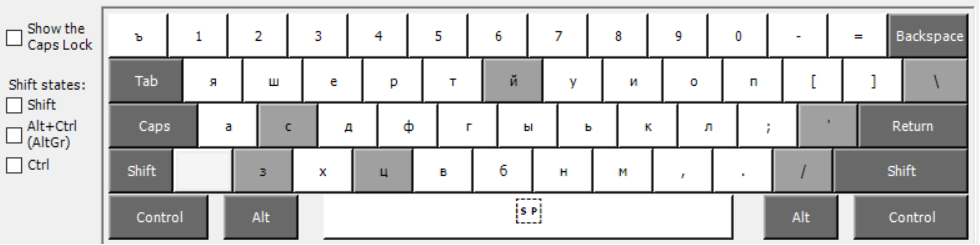
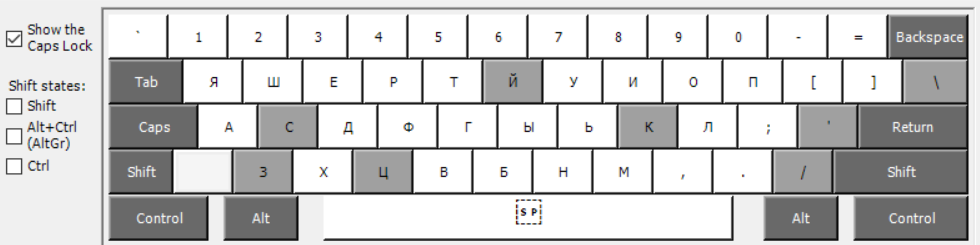
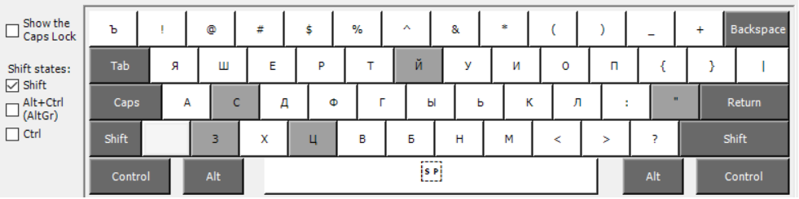
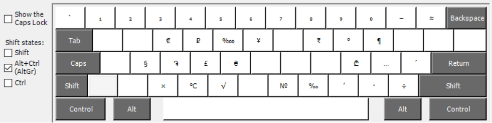
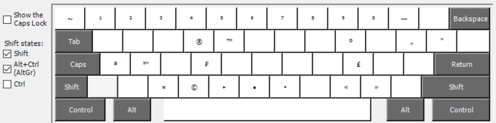

## Изображения, используемые в документации

&nbsp;&nbsp;&nbsp;&nbsp;На следующих рисунках представлена русская мнемоническая раскладка клавиатуры в разных состояниях клавиш-модификаторов, где светло-серые клавиши представляют собой составные клавиши.

##### Рис. 1. Русская мнемоническая клавиатура

##### Рис. 2. Русская мнемоническая клавиатура с включенной клавишей `Caps Lock`

##### Рис. 3. Русская мнемоническая клавиатура с нажатой клавишей `Shift`

##### Рис. 4. Русская мнемоническая клавиатура с нажатой клавишей `AltGr`

##### Рис. 5. Русская мнемоническая клавиатура с сочетанием клавиш `AltGr`+`Shift`

